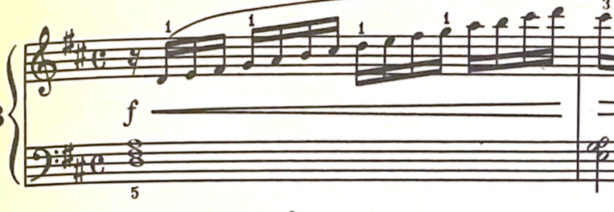
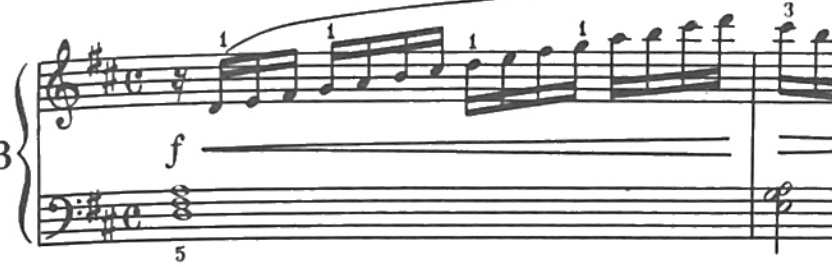

# scorecleaner

## Description

This utility takes a sheet music pdf and applies a filter to make it more printer friendly (useful for scanned scores).

### Before:



### After:



## Installation

1. Clone the repository:

    ```bash
    git clone https://github.com/zpuller/scorecleaner.git
    ```

2. Navigate into the project directory:

    ```bash
    cd scorecleaner
    ```

3. Install dependencies:

    ```bash
    python3 -m pip install numpy pillow pypdf2 
    ```


## Usage

```bash
sh gray_pdf.sh <input/path.pdf>
